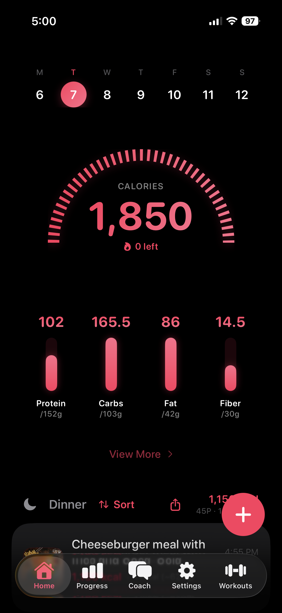
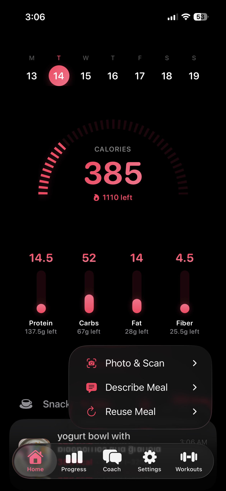
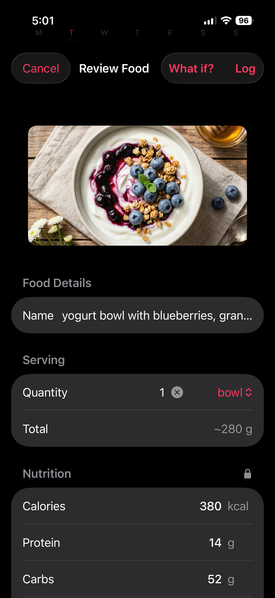
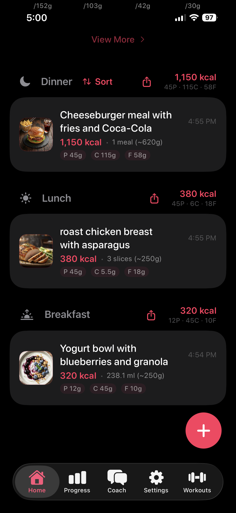
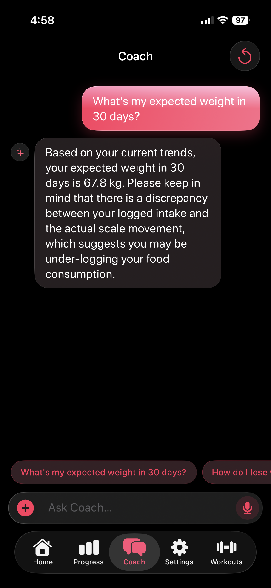
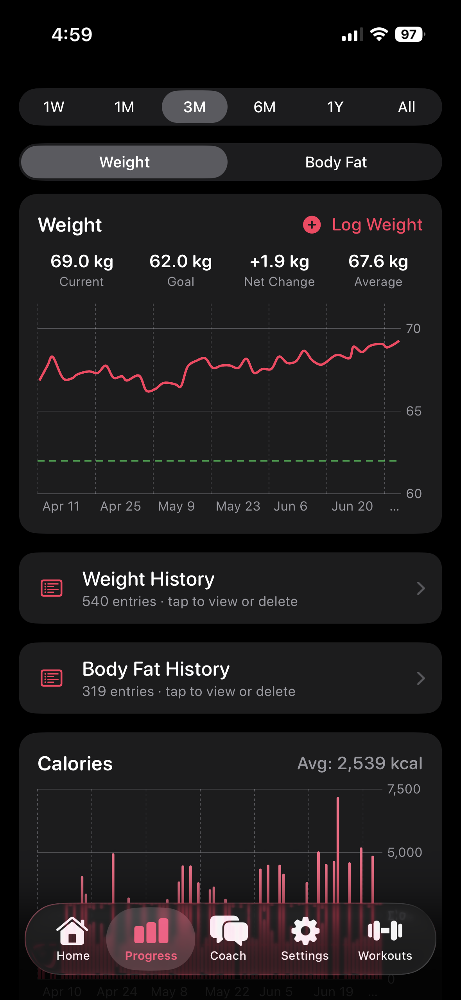
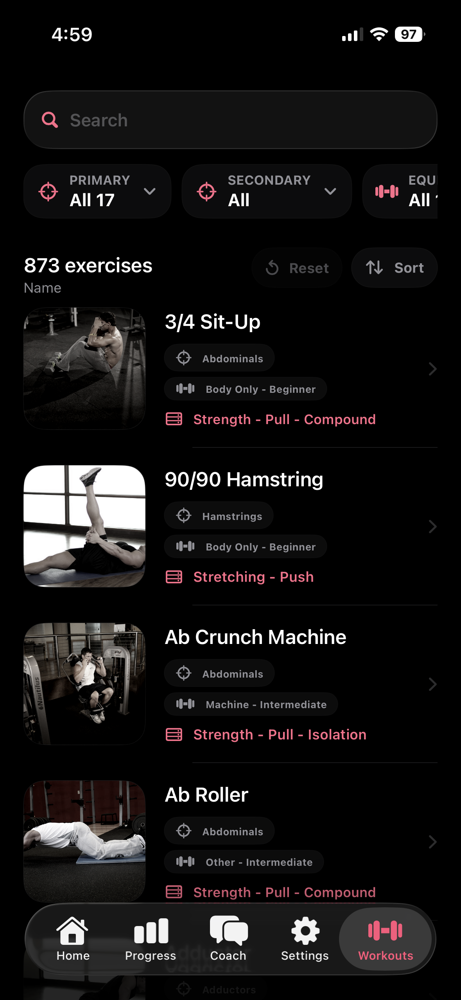

<p align="center">
  
</p>

<h1 align="center">Fud AI</h1>

<p align="center">
  <strong>Eat Smart, Live Better</strong><br>
  Snap, speak, or type your food — AI handles the rest.
</p>

<p align="center">
  
  
  
  
  
  
  
  
  <a href="https://github.com/apoorvdarshan/fud-ai/stargazers"></a>
  <a href="https://apps.apple.com/us/app/fud-ai-calorie-tracker/id6758935726"></a>
  <a href="https://play.google.com/store/apps/details?id=com.apoorvdarshan.calorietracker"></a>
</p>

---

Open-source, privacy-first calorie tracker for iOS and Android. Bring your own AI provider — 13 supported including Gemini, OpenAI, Claude, Grok, Groq, Hugging Face, Fireworks AI, DeepInfra, Mistral, and any custom OpenAI-compatible endpoint. Capture or import up to 10 food photos with an optional note, scan a barcode, ask your AI coach how to hit your goal, speak your lunch, or use Siri Shortcuts on iOS to log food and weight. On supported iPhones, food-description analysis for text, voice-transcribed, and Siri food logs can use Apple Intelligence on-device as the final fallback after BYOK provider/fallback attempts fail. No accounts, Fud AI cloud sync, tracking, or ads — completely free.

iOS and Android 6.0 (build/versionCode 33) add the same end-to-end strength workout experience: a local workout diary and logger with date navigation, sets, reps, weight, RPE, calculated calorie-burn history, Health sync, Coach access, and an in-place switch to the 873-exercise library. The last workout view stays selected, while new installs open the diary first.

The release also adds faster Saved Meal reuse, current-time meal copying, export of every stored nutrient, selectable water units, water progress on Apple Watch, current AI model presets, configurable timeouts for Ollama/custom endpoints, and reliability fixes across widgets, settings, images, and provider responses. Normal updates preserve existing local and Health data.

[App Store](https://apps.apple.com/us/app/fud-ai-calorie-tracker/id6758935726) · [Google Play](https://play.google.com/store/apps/details?id=com.apoorvdarshan.calorietracker) · [Website](https://fud-ai.app) · [Report an Issue](https://github.com/apoorvdarshan/fud-ai/issues/new?labels=bug&title=Bug:%20) · [Request a Feature](https://github.com/apoorvdarshan/fud-ai/issues/new?labels=enhancement&title=Feature:%20)

---

## Features

### Logging
- **Photo & Scan menu** — a focused submenu for Camera, Photos, and Barcode
- **Multi-photo Camera** — keep taking photos, review them horizontally, add an optional note, then analyze up to 10 separate images together
- **iOS Share Extension** — send a food photo from Photos or another app directly into Fud AI for review and logging
- **Barcode lookup** — scan packaged foods on iOS and Android and fill nutrition from Open Food Facts when product data is available
- **Multi-photo library import** — select up to 10 existing images, add an optional note, and analyze them together
- **Text input** — type food descriptions
- **Voice input** — speak your meals hands-free (6 STT options with per-provider language selection, see below)
- **iOS Siri Shortcuts** — say phrases like "Log food in Fud AI", "Calories today in Fud AI", or "Log my weight in Fud AI"; the phrase guide lives under + → Describe Meal → Siri Phrases
- **Manual Entry** — log known calories and macros without AI
- **Smart serving units** — AI can show slices, pieces, cups, ml, or other visible serving units while grams stay the source of truth
- **Review nutrition unlock** — correct calories, macros, and detailed nutrients before logging, then lock again so serving changes scale from your edits
- **Meal What if?** — preview how a reviewed meal changes today's calories and macros, then ask AI for a practical suggestion before logging
- **Saved Meals** — Recents, Frequent, and Favorites with safer swipe actions, search, and drag-to-reorder
- **Retryable analysis** — failed image analysis offers Retry and Cancel without limiting the number of retries

### Intelligence
- **AI Coach tab** — multi-turn chat with memory. Coach can retrieve relevant profile, weight, body-fat, nutrition, and workout context, then answer questions like "what's my expected weight in 30 days?" or "how did my training go this week?". Camera/photo attachments work on both platforms. Memory persists across launches; Reset starts a fresh conversation. Long-press any reply to copy.
- **AI Access** — free Bring Your Own Key: pick provider, model, fallback, custom instructions, and speech language directly on device. (The optional Fud AI Premium proxy from earlier iOS versions has been discontinued.)
- **Apple Intelligence fallback** — on supported iPhones, food-description analysis for text, voice-transcribed, and Siri food logs can use Apple Intelligence on-device as the final fallback after BYOK provider/fallback attempts fail.
- **AI optional nutrient goals** — estimate detailed nutrient goals from profile data without changing calorie/protein/carbs/fat formulas.
- **Goal-aware prompt chips** — suggested questions change based on whether your goal is Lose / Gain / Maintain
- **Thermodynamic weight forecast** — expected weight at 30/60/90 days, predicted vs observed weekly change, days-to-goal, under-logging detection. Surfaced through Coach as live context on every turn.
- **Resilient requests** — transient provider overloads (503 / 529 / 429) auto-retry with 1s / 2s / 4s exponential backoff across both food analysis and Coach chat, so short spikes resolve invisibly

### Tracking
- **Expanded nutrients** per entry — macros plus sugar, fiber, fats, cholesterol, sodium, potassium, calcium, iron, magnesium, zinc, vitamins, folate, omega-3, and more when available
- **Custom Home nutrient cards** — swap the top cards from protein/carbs/fat to fiber, sodium, vitamin D, calcium, or other tracked nutrients
- **Optional nutrient goals** — set or AI-estimate goals for the non-macro nutrients; these stay separate from the calorie and macro calculator
- **Scrollable week calendar** — swipe to any past week, configurable start day
- **Food log sorting** — keep the default grouped view, or sort meal sections by latest logging order from the Home screen
- **Progress charts** — weight trends, calorie history, macro averages (1W to All Time)
- **Progress summaries** — weight and body-fat ranges show average and net change for the selected week, month, or longer window
- **Decimal nutrition totals** — macros and detailed nutrients preserve decimal precision in logs, Home, widgets, and View More
- **Weight History** — tap-to-delete past entries and sync supported deletions to Apple Health / Health Connect
- **Goal tracking** — set target weight, BMR/TDEE auto-calculation; goal-reached alert fires from both manual logs and Apple Health reads
- **Adaptive Goals** — weekly calorie correction from observed weight trend; pinned macros stay pinned and unlocked macros auto-balance. On by default for new installs (stays off if you hand-edit your plan during onboarding)
- **Six activity levels** — Sedentary, Light, Moderate, Active, Very Active, and Extra Active use work and training descriptions instead of step-count requirements
- **Custom meal times** — choose when Breakfast, Lunch, Dinner, and Snack begin; the app uses those boundaries for automatic meal grouping
- **Optional water tracking** — off by default; set any practical daily goal, quick-log one to three glasses or a custom amount, see progress below calories, and optionally schedule a local reminder

### Workouts
- **Workout diary & logger** — plan exercises by day, swipe between weeks, and log sets, reps, weight, and RPE without starting a timer
- **Calculated workout burn** — estimate a day's calorie burn from the logged work, review or delete burn history in Progress, and optionally sync those records with Apple Health / Health Connect
- **Exercise library** — switch in place to 873 exercises with photos, primary/secondary muscle and equipment filters, search, sort, and per-exercise detail pages; the last diary/library view persists
- **Coach workout context** — Coach can retrieve workout plans, preferences, completed sessions, sets, reps, RPE, and calculated burn when answering training questions

### Health & platform
- **Apple Health** — bidirectional sync for body measurements, meal nutrition, and calculated workout calories; Siri food/weight logs use the same HealthKit paths, and Energy Burn Goals can estimate calorie targets from active/total energy while macros stay editable
- **Health Connect** — Android sync for nutrition, weight, body fat, and calculated workout calories, with permission reconciliation and backfill support; Energy Burn Goals can use recent energy data for calorie targets
- **Restore after a reinstall** — on a fresh install or new phone, food, weight, body-fat, and calculated workout-burn records previously written by Fud AI can restore from Apple Health / Health Connect; local workout plans and set details require an OS backup/device transfer
- **Apple Watch** — watchOS app and complications show calories, macros, and compact water progress when water tracking is enabled
- **Widgets** — iOS offers Fud AI in Small, Medium, and Large, small Protein, and a separate small/Lock Screen Water widget; Android offers Calorie, Protein, Today, and Water Glance widgets that update from local snapshots
- **Share the App** — native iOS share sheet from About → forwards App Store URL plus a personalized message and `fud-ai.app` link; message body localized into all 16 iOS languages
- **Update check** — About shows the installed app version, opens the App Store / Play Store when a newer version is available, and shows a tab dot for pending updates
- **Theme color** — iOS and Android Settings let users change the app accent, with matching home screen / launcher icons
- **Languages** — iOS supports 16 languages: Arabic, Azerbaijani, Dutch, English, French, German, Hindi, Italian, Japanese, Korean, Polish, Portuguese (Brazil), Romanian, Russian, Simplified Chinese, Spanish. Android supports the same set except Polish. The app auto-selects by the phone's Language setting.
- **Meal reminders** — customizable breakfast, lunch, dinner notifications
- **Dark mode** — system, light, or dark
- **Metric & imperial** units

## AI Providers

Pick any of the **13 LLM providers** for food analysis, meal what-if suggestions, optional nutrient-goal estimation, and Coach chat. Free Gemini keys are available at [aistudio.google.com/apikey](https://aistudio.google.com/apikey). Requests go directly from your device to the provider you configure. For text, voice-transcribed, and Siri food descriptions on supported iPhones, Apple Intelligence can run on-device only as the last fallback after BYOK provider/fallback attempts fail.

| Provider | Format | Highlight | Needs API Key |
|----------|--------|-----------|:---:|
| Google Gemini | Gemini API | Gemini 3.5 Flash-Lite (default) / 3.6 Flash / 3.5 Flash | Yes |
| OpenAI | OpenAI | GPT-5.4 Mini (default) / 5.5 / 5.4 Nano | Yes |
| Anthropic Claude | Messages API | Sonnet 5 (default) / Opus 4.8 / Haiku 4.5 | Yes |
| xAI Grok | OpenAI-compatible | Grok 4.3 | Yes |
| OpenRouter | OpenAI-compatible | Any model, free-form IDs | Yes |
| Together AI | OpenAI-compatible | Qwen 3.5, Gemma 4, MiniMax M3 | Yes |
| Groq | OpenAI-compatible | Qwen 3.6, very fast | Yes |
| Hugging Face | OpenAI-compatible | Gemma 4 / 3 and Qwen 3.5 / 2.5 VL (open-weight router, free-form IDs) | Yes |
| Fireworks AI | OpenAI-compatible | Qwen 3.7 Plus, MiniMax M3, Kimi K2.6 | Yes |
| DeepInfra | OpenAI-compatible | Gemma 4 / 3 vision models | Yes |
| Mistral | OpenAI-compatible | Mistral Small / Medium, Ministral 14B | Yes |
| Ollama | OpenAI-compatible (local) | Qwen 3 VL, Gemma 4, Llama 3.2 Vision, LLaVA, Moondream | No |
| Custom (OpenAI-compatible) | OpenAI-compatible | You set base URL + free-form model name | Optional |

## Speech-to-Text Providers

Pick how voice input is transcribed. Native iOS / Android is the default — free, on-device where supported, real-time. On Android, native speech first tries the on-device language path, then falls back to Android recognition with network/provider defaults if the phone lacks offline support for that language. Each provider has its own language setting: use Provider Auto, Use Device Language, or an explicit language hint where supported.

| Provider | Notes |
|----------|-------|
| Native iOS / Android (On-Device) | Free, offline where the phone supports the selected language, real-time partial results |
| Gemini Audio | Batch audio transcription through Gemini for BYOK users |
| OpenAI Whisper | Whisper-1 via `/v1/audio/transcriptions` |
| Groq (Whisper) | Whisper-large-v3, very fast, has a free tier |
| Deepgram | Nova-3, fast and accurate |
| AssemblyAI | Universal model, strong accuracy, free tier |

For Android phones where native speech is inconsistent, Groq (Whisper) or Deepgram are recommended alternatives; the developer currently uses Groq.

API keys are stored encrypted on-device: **iOS Keychain** on iOS and **EncryptedSharedPreferences backed by Android Keystore** on Android.

## How It Works

```
Photo(s) / Text / Voice
        │
        ▼
  BYOK provider API
        │
        ├── BYOK provider fallback if configured
        └── iOS Apple Intelligence final fallback for text / voice transcript / Siri food descriptions
        │
        ▼
  JSON nutrition response
        │
        ▼
  User reviews & edits
        │
        ▼
  FoodStore.addEntry()  ──▶  UserDefaults (local) + Apple Health (optional)
```

For the Coach chat, every turn builds a slim system prompt from your live profile, BMR formula in use, computed forecast, today's date/timezone, and a one-line snapshot of available data. Coach then pulls any date range of weight, body fat, calorie totals, or food entries on demand via tool calling — ask "what was my weight in March?" or "show me my body fat trend over the last 6 months" and it fetches exactly the slice it needs, including meal source, meal type, serving size, and micronutrients.

## Screenshots

An eight-screen walkthrough of the current app flow — from the dashboard and grouped logging menu through review, progress, Coach, and Workouts.

<table>
  <tr>
    <td align="center" width="33%">
      
      <br><br>
      <b>01 · Home · Dashboard</b>
      <br>
      <sub>Daily calorie ring, selected Home nutrient cards, and today's logged meals grouped by meal type. Week strip at the top for date navigation.</sub>
    </td>
    <td align="center" width="33%">
      
      <br><br>
      <b>02 · Log · Options</b>
      <br>
      <sub>Tap + for Photo &amp; Scan, Describe Meal, Reuse Meal, and optional Water groups. Camera and Photos accept up to 10 images plus an optional note.</sub>
    </td>
    <td align="center" width="33%">
      
      <br><br>
      <b>03 · Snap · Capture</b>
      <br>
      <sub>Point and shoot. The image is sent to your chosen AI provider; nutrition estimates come back within a few seconds.</sub>
    </td>
  </tr>
  <tr>
    <td align="center" width="33%">
      
      <br><br>
      <b>04 · Review · Edit</b>
      <br>
      <sub>Review the AI's guess, unlock nutrition if values need correction, adjust the serving size (everything recalculates live), preview "What if?" impact, and pick a meal type before logging.</sub>
    </td>
    <td align="center" width="33%">
      
      <br><br>
      <b>05 · Meals · Log</b>
      <br>
      <sub>The day's entries grouped by breakfast / lunch / dinner / snack. Swipe to delete, tap to edit any entry.</sub>
    </td>
    <td align="center" width="33%">
      
      <br><br>
      <b>06 · Coach · AI Chat</b>
      <br>
      <sub>Multi-turn conversation with full context of your profile, weight history, food log, and forecast. Ask "what should I eat?" or "expected weight in 30 days?".</sub>
    </td>
  </tr>
  <tr>
    <td align="center" width="33%">
      
      <br><br>
      <b>07 · Progress · Charts</b>
      <br>
      <sub>Weight trend with goal line, calorie history (intake vs. goal), and macro averages. Time ranges span 1 week to all time.</sub>
    </td>
    <td align="center" width="33%">
      
      <br><br>
      <b>08 · Workouts · Library</b>
      <br>
      <sub>Browse 873 exercises with photos, filterable by primary/secondary muscle and equipment, with search, sort, and per-exercise detail pages.</sub>
    </td>
  </tr>
</table>

## Calorie & Macro Calculation

The app calculates personalized daily targets using established nutrition science formulas:

| Step | Formula | Details |
|------|---------|---------|
| **BMR** | Katch-McArdle | `370 + 21.6 × lean mass (kg)` — used when body fat % is known |
| **BMR** | Mifflin-St Jeor | `10w + 6.25h − 5a ± 5` — fallback when body fat is unknown |
| **TDEE** | BMR × activity | Multiplier ranges from 1.2 (sedentary) to 1.9 (extra active) |
| **Daily Calories** | TDEE + adjustment | Adjustment = `weeklyChangeKg × 7700 / 7` (deficit or surplus) |
| **Protein** | Activity + goal | `0.8 – 2.2 g/kg` body weight by activity, plus +0.2 g/kg during cutting phase (Helms et al 2014); when body fat % is known, Activity Level also shows the equivalent g/kg lean-mass multiplier |
| **Fat** | Fixed ratio | `0.6 g/kg` body weight |
| **Carbs** | Auto-balanced | Remainder from calories − protein − fat (any macro can be pinned; max 2 pinned) |

All values can be manually overridden in Settings, with a **Recalculate Goals** button to snap back to formula defaults.

## Architecture

| Component | Details |
|-----------|---------|
| **Language** | Swift 5, SwiftUI, iOS 17.6+ |
| **Storage** | UserDefaults (local JSON), Keychain (API keys) |
| **AI** | `GeminiService` for food + label analysis, `ChatService` for multi-turn Coach chat, both route across all 13 providers |
| **Speech** | Native `SFSpeechRecognizer` / Android `SpeechRecognizer` or remote providers via `SpeechService` (m4a upload) |
| **Health** | HealthKit / Health Connect read-write paths for body measurements, meal nutrition, and calculated workout calories, with UUID-tagged samples for safe delete |
| **Pattern** | `@Observable` + `.environment()`, main actor isolation |
| **Localization** | `Localizable.xcstrings` (String Catalog), 16 iOS languages, auto-selected by iPhone's system language |
| **Dependencies** | Native platform frameworks; app data and API keys remain local |

### Repo Layout

```
fud-ai/
├── ios/          # SwiftUI iOS app (v6.0 build 33)
├── android/      # Kotlin + Jetpack Compose app (min SDK 26 / Android 8.0, v6.0 / versionCode 33)
├── web/          # Marketing site — https://fud-ai.app (static HTML/CSS, Cloudflare Workers)
├── APPSTORE.md   # App Store Connect listing copy (iOS)
├── PLAYSTORE.md  # Google Play Console listing copy (Android)
└── README, LICENSE, CONTRIBUTING, SECURITY, .github/
```

### Source Layout (iOS)

```
ios/
├── calorietracker.xcodeproj/         # Xcode project
├── calorietrackerTests/              # Unit test target (boilerplate)
├── calorietrackerUITests/            # UI test target (boilerplate)
├── FudAIWidgets/                     # Widget extension target (Home + Lock Screen)
├── screenshots/                      # App Store screenshot sources
└── calorietracker/
    ├── calorietrackerApp.swift       # Entry point, environment setup
    ├── ContentView.swift             # 5-tab layout (Home, Progress, Coach, Settings, Workouts)
    ├── Localizable.xcstrings         # String Catalog, 16 languages
    ├── Models/
    │   ├── AIProvider.swift          # 13 LLM providers, model lists, settings
    │   ├── SpeechProvider.swift      # 6 STT options + Keychain settings
    │   ├── ChatMessage.swift         # Coach chat message model
    │   ├── UserProfile.swift         # BMR/TDEE/macro calculations
    │   ├── FoodEntry.swift           # Food item with macros and expanded optional nutrients
    │   └── WeightEntry.swift         # Weight log entry
    ├── Views/
    │   ├── OnboardingView.swift      # 15-step onboarding flow
    │   ├── ChatView.swift            # Coach tab: bubbles, prompt chips, reset
    │   ├── FoodResultView.swift      # AI result review & edit
    │   ├── RecentsView.swift         # Saved Meals (Recents / Frequent / Favorites)
    │   ├── VoiceInputView.swift      # Native + remote STT routing
    │   ├── HomeComponents.swift      # Week strip, macro cards
    │   └── ProgressComponents.swift  # Charts, weight history
    ├── Services/
    │   ├── GeminiService.swift       # Food/label analysis, routes 13 providers
    │   ├── ChatService.swift         # Multi-turn Coach chat, routes 13 providers
    │   ├── SpeechService.swift       # Remote STT router (Gemini / OpenAI / Groq / Deepgram / AssemblyAI)
    │   ├── WeightAnalysisService.swift # Thermodynamic weight-forecast math
    │   ├── KeychainHelper.swift      # iOS Keychain wrapper
    └── Stores/
        ├── FoodStore.swift            # Food CRUD + favorites
        ├── WeightStore.swift          # Weight CRUD (auto-syncs profile weight)
        ├── ProfileStore.swift         # @Observable wrapper over UserProfile
        ├── ChatStore.swift            # Coach chat history (persisted locally)
        ├── NotificationManager.swift  # Local notification scheduler, including optional water reminders
        ├── WaterStore.swift           # Local water entries and daily goal
        ├── StrengthWorkoutStore.swift # Local workout diary, sets, and burn history
        └── HealthKitManager.swift     # Apple Health bridge (body + nutrition + workout burn)
```

## Build & Run

```bash
# Clone
git clone https://github.com/apoorvdarshan/fud-ai.git
cd fud-ai
```

### iOS

```bash
xcodebuild -project ios/calorietracker.xcodeproj \
  -scheme calorietracker \
  -destination 'platform=iOS Simulator,name=iPhone 17 Pro' build
```

Open `ios/calorietracker.xcodeproj` in Xcode, select your device, and run.

### Android

Open `android/` in Android Studio (Narwhal or newer), let Gradle sync, hit ▶ Run. Or from the CLI:

```bash
export JAVA_HOME="/Applications/Android Studio.app/Contents/jbr/Contents/Home"
cd android
./gradlew :app:assembleDebug
adb install -r app/build/outputs/apk/debug/app-debug.apk
adb shell am start -n com.apoorvdarshan.calorietracker/.MainActivity
```

First launch walks you through onboarding (gender, birthday, height/weight with metric/imperial toggle, body fat %, one of six activity levels with a protein-target preview, goal, goal speed, notifications, Apple Health / Health Connect, AI access setup, and review). A free Gemini key is available at [aistudio.google.com/apikey](https://aistudio.google.com/apikey). You can change provider anytime in **Settings → AI Access**.

## Contributing

See [CONTRIBUTING.md](CONTRIBUTING.md) for guidelines. Bug reports and feature requests welcome.

Adding a new translation? Open `ios/calorietracker/Localizable.xcstrings` in Xcode and fill in your language column — everything else is already wired.

## Security

See [SECURITY.md](SECURITY.md). Use [private vulnerability reporting](https://github.com/apoorvdarshan/fud-ai/security/advisories/new) for sensitive issues.

## Privacy

No accounts, Fud AI-operated cloud sync, or analytics. BYOK API keys are protected by iOS Keychain or Android EncryptedSharedPreferences, and requests go directly to the provider you choose. Food, weight, body-fat, water, and workout logs, custom meal times, goals, preferences, cached images, and widget/Watch snapshots are local except for OS backup/device transfer and the specific AI/STT, barcode, health-sync, update-check, export, or sharing action you initiate. Shared meal links carry the selected meal details in the URL, so anyone with the link can read them. Apple Health / Health Connect access is optional and can be reviewed or revoked through Manage Access. **Delete All Data** wipes the current local installation, including saved keys, water history, and workout plans/history, but never removes Apple Health, Health Connect, or older OS backups. See the complete [Privacy Policy](https://fud-ai.app/privacy.html).

## License

MIT License. See [LICENSE](LICENSE).

## Contact

- **Developer:** Apoorv Darshan
- **Email:** apoorv@fud-ai.app or ad13dtu@gmail.com
- **Follow on X:** [@apoorvdarshan](https://x.com/apoorvdarshan)
- **Follow on Instagram:** [@fudai.app](https://www.instagram.com/fudai.app/)
- **Follow on LinkedIn:** [Fud AI](https://www.linkedin.com/company/fud-ai-app)
- **View on TrustMRR:** [Fud AI - Calorie Tracker](https://trustmrr.com/startup/fud-ai-calorie-tracker)
- **Report an Issue:** [github.com/apoorvdarshan/fud-ai/issues/new?labels=bug&title=Bug:%20](https://github.com/apoorvdarshan/fud-ai/issues/new?labels=bug&title=Bug:%20)
- **Request a Feature:** [github.com/apoorvdarshan/fud-ai/issues/new?labels=enhancement&title=Feature:%20](https://github.com/apoorvdarshan/fud-ai/issues/new?labels=enhancement&title=Feature:%20)

## Support the Project

Fud AI is fully free, open source, and privacy-first — no ads, no subscription. If it helps you, consider supporting development (on iOS there's an in-app Tip Jar under Settings → About) — every bit keeps this project alive.

[](https://ko-fi.com/apoorvdarshan)
[](https://www.producthunt.com/products/fud-ai-calorie-tracker)

You can also help by [voting on Product Hunt](https://www.producthunt.com/products/fud-ai-calorie-tracker), [starring the repo](https://github.com/apoorvdarshan/fud-ai), [filing bugs](https://github.com/apoorvdarshan/fud-ai/issues/new?labels=bug&title=Bug:%20), or [requesting features](https://github.com/apoorvdarshan/fud-ai/issues/new?labels=enhancement&title=Feature:%20).

## Star History

<a href="https://www.star-history.com/?type=date&repos=apoorvdarshan%2Ffud-ai">
  <picture>
    <source media="(prefers-color-scheme: dark)" srcset="https://api.star-history.com/chart?repos=apoorvdarshan/fud-ai&type=date&theme=dark&legend=top-left&sealed_token=26KkxrkUOXIbh-qbZkWnLZcniMwJBnGUHZjfZWE-0iyandO7xSyYfdlx9mJAKSwxOTXgIbH3Lo5s44y5aE2P73Znaf4bUtFO5KS5i2zKujXAlWnhYorpTfq8Hg4GOJTdgZtmsZHkknr-EGNkBOvZfm5Ve13V3nqDjjofXhRe4gKs6-ad2NM2hXAxQYJJ" />
    <source media="(prefers-color-scheme: light)" srcset="https://api.star-history.com/chart?repos=apoorvdarshan/fud-ai&type=date&legend=top-left&sealed_token=26KkxrkUOXIbh-qbZkWnLZcniMwJBnGUHZjfZWE-0iyandO7xSyYfdlx9mJAKSwxOTXgIbH3Lo5s44y5aE2P73Znaf4bUtFO5KS5i2zKujXAlWnhYorpTfq8Hg4GOJTdgZtmsZHkknr-EGNkBOvZfm5Ve13V3nqDjjofXhRe4gKs6-ad2NM2hXAxQYJJ" />
    
  </picture>
</a>

## Contributors

Thanks to everyone who has contributed to making Fud AI better:

<a href="https://github.com/apoorvdarshan/fud-ai/graphs/contributors">
  
</a>

## Credits

Exercise data, muscle glyphs, and barcode nutrition data come from open projects — see [ASSET_CREDITS.md](ASSET_CREDITS.md).
